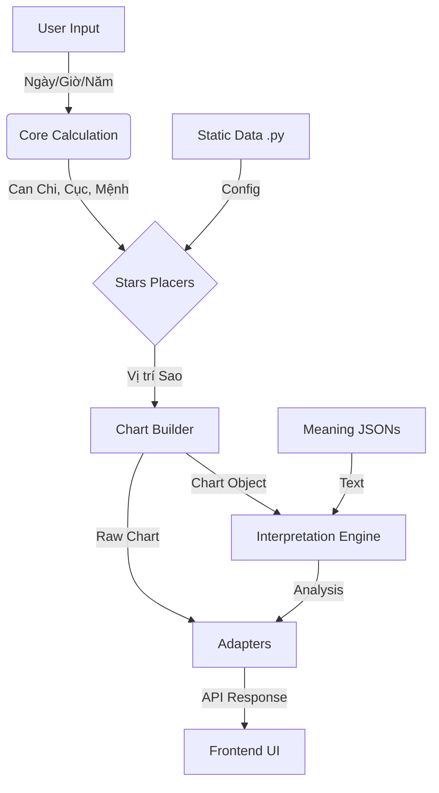

# PROJECT STRUCTURE TRACE & UPDATE FRAMEWORK
**Cập nhật lần cuối**: 2025-12-20

**Mục đích**: Tài liệu này đóng vai trò là bản đồ (Map) và bộ khung (Framework) để đảm bảo tính nhất quán của dự án.

## Trạng Thái Xác Minh (Verification Status)
| Check | Status | Ngày |
|-------|--------|------|
| Phase 1: File Existence | PASS | 2025-12-20 |
| Phase 2: Import Chain | PASS | 2025-12-20 |
| Phase 3: End-to-End Test | PASS | 2025-12-20 |
| Phase 4: Traceability Matrix | **PASS & SYNCED** | 2025-12-20 |

**Recent Updates**: 
- [2025-12-22] Dọn dẹp dự án: Archive 14 debug scripts, thêm .gitignore cho data lớn
- [2025-12-22] Thêm section 1.11: Chi tiết `analytics/` (Engines, Exporters, Solvers)
- Synced Code <-> Docs references for Tu Hoa, Tuan Triet, Bac Sy, Thien Giai.
- Updated `CALCULATION_GUIDE.md` with Sections 7.4, 7.6, 7.8, 8.1.
- Implemented fixes for Thien Giai and Bac Sy direction.

---

## 1. CẤU TRÚC THƯ MỤC (Directory Inventory)

### 1.1. Thư mục Gốc (`python/`)
| File/Thư mục | Vai trò | Trạng thái |
|--------------|---------|------------|
| `app.py` | **EntryPoint** - Flask Server, định nghĩa API Routes | Active |
| `adapters.py` | Chuyển đổi output nội bộ sang định dạng API chuẩn | Active |
| `core/` | Tính toán Thiên Văn (Âm Dương, Can Chi, Cục, Mệnh/Thân) | Active |
| `stars/` | Logic An Sao (Placers) - output là vị trí index | Active |
| `data/` | Dữ liệu Tĩnh (.py) và Ý nghĩa (.json) | Active |
| `chart/` | Bộ xây dựng Lá Số (Chart Builder) | Active |
| `logic/` | Bộ logic nghiệp vụ (Finder, Reverse Lookup) | Active |
| `interpretation/` | Bộ Xử Lý Luận Giải | Active |
| `services/` | Tích hợp bên ngoài (Gemini AI) | Active |
| `tests/` | Bộ kiểm thử (22 test files) | Active |
| `static/` | Frontend Assets (CSS, JS) | Active |
| `templates/` | Frontend HTML (3 files) | Active |
| `docs/` | Tài liệu dự án | Active |

---

### 1.2. Chi tiết `python/core/` (6 files)
| File | Chức năng | Ghi chú |
|------|-----------|---------|
| `__init__.py` | Package init, export symbols | - |
| `can_chi_calc.py` | Tính toán Can Chi năm/tháng/ngày/giờ | Core |
| `cuc_calc.py` | Xác định Ngũ Hành Cục và Nạp Âm | Algorithmic |
| `cung_menh.py` | Tính Cung Mệnh và Cung Thân | Core |
| `fortune_periods.py` | Tính Đại Vận, Tiểu Vận, Lưu Niên | UC-05 |
| `lunar_converter.py` | Chuyển đổi Dương lịch - Âm lịch | Core |

---

### 1.3. Chi tiết `python/stars/` (11 files)
| File | Chức năng | Nhóm sao |
|------|-----------|----------|
| `__init__.py` | Package init | - |
| `chinh_tinh_placer.py` | An 14 Chính Tinh | Tử Vi, Thiên Phủ hệ |
| `luc_cat_placer.py` | An 6 Cát Tinh | Tả Phụ, Hữu Bật, Văn Xương, Văn Khúc, Thiên Khôi, Thiên Việt |
| `luc_sat_placer.py` | An 6 Sát Tinh | Kình Dương, Đà La, Hỏa Tinh, Linh Tinh, Địa Không, Địa Kiếp |
| `truong_sinh_placer.py` | An Vòng Trường Sinh (12 sao) | Trường Sinh, Mộc Dục, ... Tuyệt |
| `bac_sy_placer.py` | An Vòng Bác Sỹ (12 sao) | Bác Sỹ, Lực Sỹ, ... Tướng Quân |
| `thai_tue_placer.py` | An Vòng Thái Tuế (12 sao) | Thái Tuế, Thiếu Dương, ... Tang Môn |
| `other_stars_placer.py` | An các sao phụ khác | Đào Hoa, Thiên Mã, Hồng Loan, ... |
| `bo_sung_placer.py` | An sao bổ sung + Mệnh Chủ / Thân Chủ | Giải Thần, Thiên Đức, ... |
| `tu_hoa_applier.py` | Áp dụng Tứ Hóa | Hóa Lộc, Hóa Quyền, Hóa Khoa, Hóa Kỵ |
| `tuan_triet_placer.py` | An Tuần và Triệt | Algorithmic |

---

### 1.4. Chi tiết `python/data/` (17 .py files + 10 JSON meanings)

#### 1.4.1. Config Files (.py)
| File | Nội dung |
|------|----------|
| `__init__.py` | Package init, export all symbols |
| `can_chi.py` | Hằng số THIEN_CAN, DIA_CHI, GIO_SINH_RANGE |
| `chinh_tinh.py` | Bảng tra Chính Tinh, STAR_BRIGHTNESS_TABLE |
| `cung_cuc.py` | CUC_TABLE, CUC_TYPE, NAP_AM, THIEN_PHU_POSITION |
| `tu_hoa.py` | TU_HOA bảng tra theo Can năm |
| `phu_tinh_luc_cat.py` | Bảng tra Lục Cát |
| `phu_tinh_luc_sat.py` | Bảng tra Lục Sát |
| `phu_tinh_truong_sinh.py` | TRUONG_SINH_BASE, TRUONG_SINH_STARS |
| `phu_tinh_bac_sy.py` | BAC_SY_STARS |
| `phu_tinh_thai_tue.py` | THAI_TUE_STARS |
| `phu_tinh_other.py` | Bảng tra Đào Hoa, Thiên Mã, Hồng Loan, ... |
| `phu_tinh_bo_sung.py` | Bảng tra sao bổ sung, Mệnh Chủ / Thân Chủ |
| `phu_tinh_tuan_triet.py` | TRIET_POSITION, calculate_tuan_position |
| `star_brightness.py` | get_star_brightness() - Miếu, Vượng, Đắc, Hãm |
| `star_details.py` | CHINH_TINH_DETAILS - chi tiết luận giải |
| `finder_options.py` | Options cho Finder UI (Traits, Events, ...) |
| `finder_rules.py` | FINDER_RULES - quy tắc mapping trait -> sao |

#### 1.4.2. Meaning Files (JSON)
| File | Nội dung |
|------|----------|
| `chinh_tinh.json` | Ý nghĩa 14 Chính Tinh |
| `phu_tinh.json` | Ý nghĩa Phụ Tinh cơ bản |
| `phu_tinh_special.json` | Ý nghĩa Phụ Tinh đặc biệt |
| `truong_sinh.json` | Ý nghĩa Vòng Trường Sinh |
| `dai_van.json` | Ý nghĩa Đại Vận |
| `tieu_han.json` | Ý nghĩa Tiểu Hạn / Lưu Niên |
| `than_cu.json` | Ý nghĩa Thân Cư (Thân tại cung nào) |
| `nhan_tuong.json` | Nhân Tướng Học (chưa tích hợp logic) |
| `giap_meanings.json` | Ý nghĩa các Giáp |
| `phi_hoa_nam.json` | Phi Hóa theo năm |

---

### 1.5. Chi tiết `python/chart/` (2 files)
| File | Chức năng |
|------|-----------|
| `__init__.py` | Package init |
| `chart_builder.py` | Orchestration - gọi core + stars + adapter |

---

### 1.6. Chi tiết `python/logic/` (5 files)
| File | Chức năng |
|------|-----------|
| `__init__.py` | Package init |
| `candidate_finder.py` | Finder cơ bản (tìm giờ sinh) |
| `reverse_lookup_engine.py` | Engine nâng cao Level 2 (Weighted Scoring) |
| `reverse_solver.py` | Solver cũ (Legacy) |
| `trait_mapper.py` | Map đặc điểm -> sao |

---

### 1.7. Chi tiết `python/interpretation/` (4 files + meanings/)
| File | Chức năng |
|------|-----------|
| `__init__.py` | Package init |
| `cach_cuc.py` | Phân tích Cách Cục (cách phú, cách quý, ...) |
| `chart_analyzer.py` | Phân tích tổng quan lá số |
| `patterns.py` | Nhận diện các Pattern đặc biệt |

#### Submodule `interpretation/meanings/`
| File | Chức năng |
|------|-----------|
| `__init__.py` | Package init, loader |
| `loader.py` | Load JSON meanings |
| `chinh_tinh_meanings.py` | Wrapper ý nghĩa Chính Tinh |
| `palace_meanings.py` | Ý nghĩa 12 Cung |
| `phu_tinh_meanings.py` | Wrapper ý nghĩa Phụ Tinh |

---

### 1.8. Chi tiết `python/services/` (2 files)
| File | Chức năng |
|------|-----------|
| `__init__.py` | Package init |
| `gemini_client.py` | Tích hợp Google Gemini AI (Hỏi Thầy AI) |

---

### 1.9. Chi tiết `python/tests/` (22 files)
| File | Mục đích test |
|------|---------------|
| `verify_full_flow.py` | Kiểm tra end-to-end lá số |
| `verify_1994_giap_tuat.py` | Kiểm tra case 1994 cụ thể |
| `test_qc_comprehensive.py` | QC tổng hợp |
| `test_tuan_triet.py` | Kiểm tra Tuần/Triệt |
| `test_nam_phai_expert.py` | Kiểm tra logic Nam Phái |
| `test_hotfix_cuc.py` | Kiểm tra Cục |
| `test_compare_mau.py` | So sánh với mẫu chuẩn |
| (Và các file test khác...) | - |

---

### 1.10. Chi tiết `python/templates/` (3 files)
| File | Chức năng |
|------|-----------|
| `index.html` | Trang chủ - Lập Lá Số |
| `finder.html` | Công cụ Tìm Giờ Sinh |
| `reverse_lookup_snippet.html` | Snippet cũ (Legacy) |

---

### 1.11. Chi tiết `python/analytics/` (Engines & Tools)

#### Engines (Logic nghiệp vụ - Production)
| File | Chức năng | Import bởi |
|------|-----------|------------|
| `definitions.py` | Constants: BEAUTY_STARS, LUCKY_STARS, TRAGIC_STARS | Nhiều engines |
| `talent_fortune_engine.py` | Phân tích Tài Mệnh | `app.py` |
| `beauty_engine.py` | Phân loại Hồng Nhan 5 cấp | Exporters |
| `multi_score_engine.py` | Chấm điểm đa chiều (Mệnh, Tài, Quan...) | Solvers |
| `archetype_engine.py` | Nhận diện Archetype | Solvers |

#### Exporters (Sinh data)
| File | Output |
|------|--------|
| `export_beauty_dataset.py` | `*.jsonl` - Beauty Female |
| `export_full_dataset.py` | Full chart JSONL |
| `export_tai_menh_dataset.py` | Tài Mệnh JSONL |
| `export_relational_dataset.py` | Dim/Fact tables |
| `generate_sample_csv.py` | Sample CSV |

#### Solvers (Nghiên cứu)
| File | Mục đích |
|------|----------|
| `solve_best_fate_*.py` | Tìm ngày giờ sinh tốt nhất |
| `solve_balanced_fate.py` | Tìm số cân bằng nhất |
| `solve_archetypes.py` | Tìm Archetype nổi bật |

#### Verifiers & Analyzers
| File | Mục đích |
|------|----------|
| `verify_canh_ngo_5_mechanisms.py` | Chứng minh 5 cơ chế rủi ro Canh Ngọ |
| `visualize_data.py` | Tạo dashboard HTML |
| `rank_60_hoa_giap.py` | Xếp hạng 60 Hoa Giáp |

---

## 2. TRACEABILITY MATRIX (Bản Đồ Tính Năng)

Khi muốn cập nhật một tính năng, hãy sửa đồng bộ các file cùng hàng ngang:

| TÍNH NĂNG (Feature) | LOGIC (Stars/Core) | DATA CONFIG (.py) | MEANING (.json) |
|---------------------|-------------------|-------------------|-----------------|
| **Chính Tinh** (14 sao) | `stars/chinh_tinh_placer.py` | `data/chinh_tinh.py` | `data/meanings/chinh_tinh.json` |
| **Lục Cát** | `stars/luc_cat_placer.py` | `data/phu_tinh_luc_cat.py` | `data/meanings/phu_tinh.json` |
| **Lục Sát** | `stars/luc_sat_placer.py` | `data/phu_tinh_luc_sat.py` | `data/meanings/phu_tinh.json` |
| **Vòng Thái Tuế** | `stars/thai_tue_placer.py` | `data/phu_tinh_thai_tue.py` | `data/meanings/dai_van.json` |
| **Vòng Bác Sỹ** | `stars/bac_sy_placer.py` | `data/phu_tinh_bac_sy.py` | `data/meanings/phu_tinh.json` |
| **Vòng Trường Sinh** | `stars/truong_sinh_placer.py` | `data/phu_tinh_truong_sinh.py` | `data/meanings/truong_sinh.json` |
| **Tứ Hóa** | `stars/tu_hoa_applier.py` | `data/tu_hoa.py` | `data/meanings/phu_tinh.json` |
| **Tuần/Triệt** | `stars/tuan_triet_placer.py` | `data/phu_tinh_tuan_triet.py` | N/A |
| **Sao Bổ Sung** | `stars/bo_sung_placer.py` | `data/phu_tinh_bo_sung.py` | `data/meanings/phu_tinh_special.json` |
| **Thuật toán Cục** | `core/cuc_calc.py` | `data/cung_cuc.py` | N/A |
| **Mệnh/Thân** | `core/cung_menh.py` | N/A | `data/meanings/than_cu.json` |
| **Đại Vận** | `core/fortune_periods.py` | N/A | `data/meanings/dai_van.json` |
| **Tiểu Vận/Lưu Niên** | `core/fortune_periods.py` | N/A | `data/meanings/tieu_han.json` |
| **Cách Cục** | `interpretation/cach_cuc.py` | N/A | N/A |
| **Pattern Analysis** | `interpretation/patterns.py` | N/A | N/A |
| **Finder Tool** | `logic/reverse_lookup_engine.py` | `data/finder_rules.py` | N/A |
| **AI Integration** | `services/gemini_client.py` | N/A | N/A |

---

## 3. API ROUTES MAPPING

| Route | Method | Handler | Chức năng |
|-------|--------|---------|-----------|
| `/` | GET | `index()` | Trang chủ |
| `/finder` | GET | `finder_page()` | Trang Finder |
| `/api/generate` | POST | `generate_legacy()` | Alias cho v1 |
| `/api/v1/chart/generate` | POST | `generate_v1()` | Tạo lá số chính |
| `/api/finder/solve` | POST | `finder_solve()` | Tìm giờ sinh |
| `/api/v1/finder/solve` | POST | `finder_solve_v1()` | Alias v1 |
| `/api/fortune` | POST | `get_fortune()` | Vận hạn năm |
| `/api/ask-ai` | POST | `ask_ai()` | Hỏi Thầy AI |
| `/api/chat-ai` | POST | `chat_ai()` | Chat với AI |
| `/api/star/<name>` | GET | `get_star_info()` | Chi tiết sao |
| `/api/palace/<name>` | GET | `get_palace_info()` | Chi tiết cung |
| `/api/v1/utils/hours` | GET | `get_hours_v1()` | Danh sách giờ |

---

## 4. QUY TRÌNH CẬP NHẬT (Workflow)

### Quy trình 1: Cập nhật ý nghĩa sao
1. Tra Trace Map -> Xác định file JSON
2. Mở file JSON và sửa
3. Không cần sửa Python nếu chỉ đổi text

### Quy trình 2: Thêm sao mới
1. Xác định nhóm sao (Lục Cát, Bổ Sung, ...)
2. Thêm vào Data Config (`data/phu_tinh_*.py`)
3. Thêm logic vào Placer (`stars/*_placer.py`)
4. Thêm meaning vào JSON (`data/meanings/*.json`)
5. Verify bằng test

### Quy trình 3: Thêm API mới
1. Định nghĩa route trong `app.py`
2. Tạo handler function
3. Sử dụng `adapters.py` nếu cần format output
4. Thêm test case trong `tests/`

---

## 5. CHECKLIST TRƯỚC KHI COMMIT

- [ ] Đã cập nhật Meaning chưa? (Nếu thêm sao mới)
- [ ] Đã khai báo trong Data Config chưa?
- [ ] Đã verify trên Frontend chưa?
- [ ] Có conflict với logic Nam Phái không?
- [ ] Đã chạy test suite chưa?

---

## 6. DATA FLOW DIAGRAM

---

*Tài liệu này cần được cập nhật mỗi khi có Module mới được thêm vào.*
