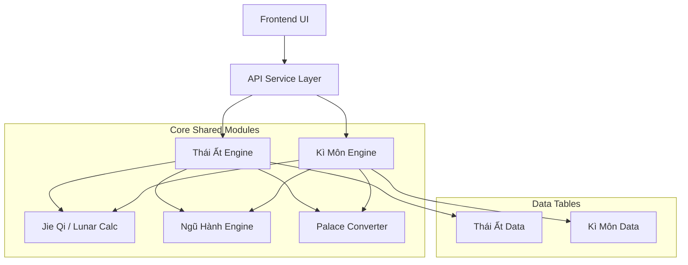

# THÁI ẤT & KÌ MÔN MASTER GUIDE

> File quản lý trung tâm cho việc phát triển và tích hợp module "Tam Thức" (Thái Ất, Kì Môn) vào Tu Vi App.

---

## I. KIẾN TRÚC TỔNG QUAN

Hệ thống được xây dựng dựa trên các lớp (layers) tách biệt, tận dụng tối đa code core cũ của Tử Vi.



---

## II. FILE MAPPING VÀ TRẠNG THÁI

### 1. Core Modules (Nền tảng chung)

| File Path | Chức năng | Trạng thái | Ghi chú |
|-----------|-----------|------------|---------|
| `python/core/jie_qi_calculator.py` | Tính 24 Tiết Khí, Kinh độ mặt trời | ✅ **DONE** | Critical cho Kì Môn |
| `python/core/ngu_hanh_engine.py` | Logic Ngũ Hành (Sinh/Khắc) | ✅ **DONE** | Base logic |
| `python/core/palace_converter.py` | Chuyển đổi 12 Cung ↔ 9 Cung | ✅ **DONE** | Lạc Thư mapping |
| `python/core/lunar_converter.py` | Chuyển đổi Âm Dương | ✅ **Exist** | Code cũ ổn định |
| `python/core/can_chi_calc.py` | Tính Can Chi | ✅ **Exist** | Code cũ ổn định |

### 2. Thái Ất Thần Số (Thien Van Module)

| File Path | Chức năng | Trạng thái | Ghi chú |
|-----------|-----------|------------|---------|
| `python/logic/thai_at_engine.py` | Engine tính toán chính | ✅ **DONE** | Tính Nguyên, Hội, Kỷ, An Thần |
| `python/data/thai_at_tables.py` | Lookup Tables | ✅ **DONE** | 16 Thần, Ngũ Nguyên |
| `python/services/thai_at_service.py` | API Wrapper | ⏳ **TODO** | Cần expose ra API |

### 3. Kì Môn Độn Giáp (Dia Ly Module)

| File Path | Chức năng | Trạng thái | Ghi chú |
|-----------|-----------|------------|---------|
| `python/logic/ki_mon_engine.py` | Engine tính toán chính | ✅ **DONE** | Tính Cục, Dương/Âm Độn, An Sao/Môn |
| `python/data/ki_mon_tables.py` | Lookup Tables | ✅ **DONE** | Bát Môn, Cửu Tinh, Bát Thần |
| `python/services/ki_mon_service.py` | API Wrapper | ⏳ **TODO** | Cần expose ra API |

### 4. Frontend & Integration

| File Path | Chức năng | Trạng thái | Ghi chú |
|-----------|-----------|------------|---------|
| `python/static/js/palace_9_grid.js` | UI Grid 9 Cung (3x3) | ⏳ **TODO** | Adapt từ cung_grid.js |
| `python/templates/thai_at_view.html` | Giao diện Thái Ất | ⏳ **TODO** | |
| `python/templates/ki_mon_view.html` | Giao diện Kì Môn | ⏳ **TODO** | |

---

## III. HƯỚNG DẪN SỬ DỤNG ENGINE (QUICK START)

### 1. Sử dụng Thái Ất Engine

```python
from logic.thai_at_engine import ThaiAtEngine

# Khởi tạo (Năm, Tháng, Ngày, Giờ)
engine = ThaiAtEngine(2024, 12, 24, 10)

# Lấy thông tin Nguyên, Hội, Kỷ
nguyen = engine.get_nguyen() # -> 'Giáp Tý Nguyên'
hoi = engine.get_hoi()       # -> 'Ngọ Hội'

# Phân tích 1 cung (Ví dụ cung 1 - Khảm)
analysis = engine.analyze_palace(1)
print(analysis['nature'])    # 'cat', 'hung', 'trung'
```

### 2. Sử dụng Kì Môn Engine

```python
from logic.ki_mon_engine import KiMonEngine

# Khởi tạo
engine = KiMonEngine(2024, 12, 24, 10)

# Lấy Cục
cuc_info = engine.get_cuc_info() # -> Cục 6, Dương Độn

# Lấy hướng tốt nhất
best = engine._find_best_direction(engine.get_full_chart()['palaces'])
print(f"Hướng tốt: {best['direction']} (Điểm: {best['score']})")
```

---

## IV. KẾ HOẠCH PHÁT TRIỂN TIẾP THEO (NEXT STEPS)

### Step 1: API Development (Backend)
- [ ] Tạo `python/services/thai_at_service.py` (Flask Blueprint)
- [ ] Tạo `python/services/ki_mon_service.py` (Flask Blueprint)
- [ ] Register Blueprints vào `app.py` chính

### Step 2: Frontend Implementation
- [ ] Tạo Grid System 3x3 cho 9 Cung (HTML/CSS/JS)
- [ ] Hiển thị thông tin Bát Môn, Cửu Tinh, Thần lên Grid
- [ ] Highlight các Cung tốt/xấu (Cát/Hung)

### Step 3: Integration
- [ ] Thêm menu chọn "Thái Ất" và "Kì Môn" vào App chính
- [ ] Liên kết dữ liệu Input từ form sinh (Ngày giờ sinh) sang Engine mới

---

## V. CÁC QUY TẮC QUAN TRỌNG

1.  **Reuse Core**: Không viết lại logic tính Âm Dương, Can Chi. Import từ `core/`.
2.  **Separate Engines**: Logic Thái Ất và Kì Môn phải độc lập, chỉ chia sẻ Core.
3.  **Data Driven**: Mọi thông tin lookup (tên sao, tính chất) để trong `data/`, không hardcode trong logic.
4.  **Interface Consistent**: Cả 2 engine đều phải có phương thức `get_full_chart()` trả về JSON standard để Frontend dễ render.

---
**File Management:**
- Tài liệu Spec chi tiết: `docs/THAI_AT_KI_MON_SPEC.md`
- Master Plan này: `THAI_AT_KI_MON_MASTER.md`
